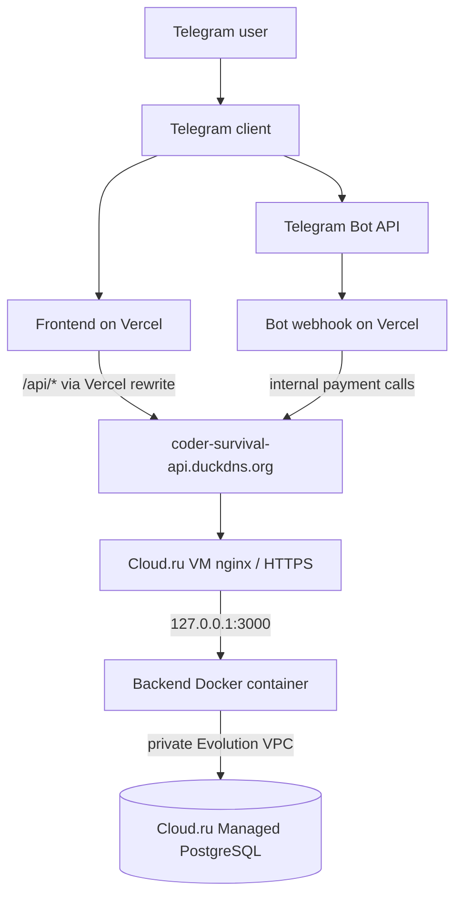

# Coder Survival — Current Architecture

**Date:** 2026-09-09  
**Status:** canonical target architecture for the Cloud.ru cutover.

## Components

- **Frontend** — Preact + Phaser + Vite static build on Vercel, loaded in Telegram Mini App WebView.
- **Bot webhook** — Vercel serverless runtime. Telegram Stars fulfillment calls the backend through `BOT_BACKEND_SECRET`.
- **Backend API** — Node 20 + Express in Docker on a Cloud.ru Evolution Ubuntu VM.
- **Public backend edge** — host nginx + Let's Encrypt on the VM. Backend container publishes only `127.0.0.1:3000`.
- **Database** — Cloud.ru Evolution Managed PostgreSQL reachable by private IP only. VM and database must be in the same Evolution project and subnet.
- **Public API hostname** — `coder-survival-api.duckdns.org`; the DuckDNS record is repointed from the retired Vultr host to the Cloud.ru VM public IP.
- **Payments** — Telegram Stars code remains present, but production real-money paths remain disabled until an explicit go-live (`PAYMENTS_ENABLED=false`).

## Diagram

## Network policy

Cloud.ru VM security group:

- 22/tcp: restricted SSH sources.
- 80/tcp: public, for HTTP/ACME and redirect.
- 443/tcp: public HTTPS API.
- 3000/tcp: not public; container binds to loopback.
- 5432/tcp: not public; Managed PostgreSQL uses the private subnet.

## Deployment path

`.github/workflows/deploy-backend.yml` is manual-only and targets the GitHub environment `production-cloudru`.

Release sequence:

1. PostgreSQL-backed backend test gate.
2. Immutable Docker build tagged with commit SHA on GitHub Actions.
3. SSH host-key-pinned transfer to the VM.
4. Pre-migration `pg_dump`.
5. Production migration using the new image.
6. Container swap through `docker-compose.backend.yml`.
7. Internal container health check.
8. Automatic rollback to the previous image on failed health.
9. Public HTTPS `/health` verification.

The scheduled `.github/workflows/backend-health.yml` checks that `/health` reports both `status=ok` and `db=connected`.

## Database contract

The application supports `DB_HOST`, `DB_PORT`, `DB_NAME`, `DB_USER`, `DB_PASSWORD`, and configurable SSL. Cloud.ru's current Managed PostgreSQL guide documents private-IP PostgreSQL connectivity from a VM in the same project/subnet; the Cloud.ru deployment therefore starts with `CLOUDRU_DB_SSL=false`. Change it only if the selected cluster configuration explicitly requires TLS.

Managed PostgreSQL automatic backups should remain enabled; deployment also keeps a short-lived pre-migration `pg_dump` on the VM for release rollback/recovery.

## Frontend routing

`frontend/vercel.json` already points `/api/*` and `/health` at `https://coder-survival-api.duckdns.org`. Preserving this hostname means the Cloud.ru infrastructure cutover does not require a frontend code change.
