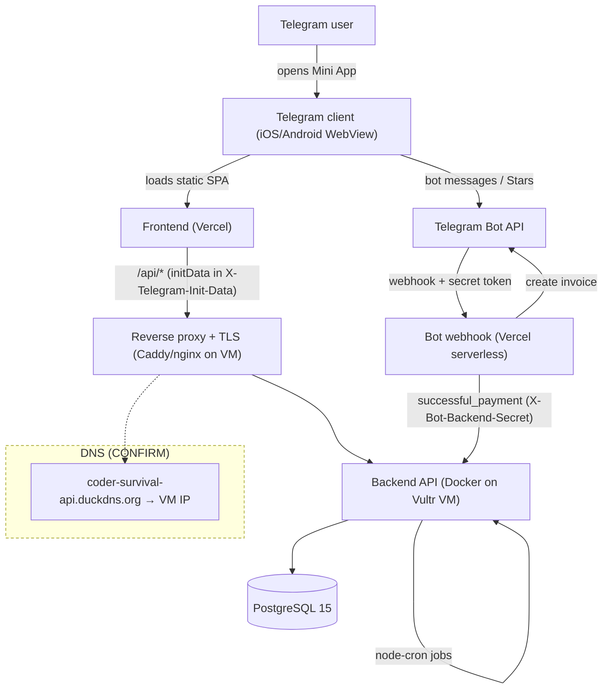

# Coder Survival — Current Architecture

**Date:** 2026-07-24 · **Status:** canonical (supersedes topology claims in
`DEPLOY.md`, `HANDOFF.md`, `AGENT_HANDOFF.md`, `YANDEX_CLOUD_MIGRATION_PLAN.md`,
`RENDER_SETUP.md`, `project-status.json`).

> **Live verification — 2026-08-02.** `coder-survival-api.duckdns.org` resolves
> to `185.92.221.219`; reverse DNS identifies `vultrusercontent.com`; HTTPS
> `/health` returns `200`. The backend is on Vultr. The SSH target is never
> committed: releases receive it as `CODER_SURVIVAL_VM_SSH_TARGET` / the
> `VM_SSH_TARGET` GitHub secret.

## Components

- **Frontend** (Preact 10 + Phaser 3.60 + Vite): static build hosted on
  **Vercel**. Loaded inside the Telegram Mini App WebView. `vercel.json`
  rewrites `/api/*` to the backend via the DuckDNS hostname.
- **Bot webhook** (Grammy, serverless): **Vercel** function
  (`bot/api/webhook.js`, `bot/api/invoice-link.js`). Verifies Telegram’s
  `X-Telegram-Bot-Api-Secret-Token` (now fail-closed).
- **Backend API** (Node 20 + Express): **Docker container on a Vultr VM**,
  port 3000, behind a reverse proxy (Caddy/nginx) terminating TLS. Health at
  `/health`.
- **Database:** externally managed PostgreSQL. Migrations via `backend/src/migrate.js`
  (`schema_migrations`, filename-keyed, transactional).
- **Payments:** Telegram Stars (`XTR`). Invoice created via bot; confirmation via
  bot `successful_payment` → backend `internal/payments` (secured with
  `BOT_BACKEND_SECRET`).
- **Cron/jobs:** `node-cron` inside the backend process (season rotation, daily
  battle, hackathon, achievements, random events, flash sales, daily summary,
  health alert).
- **Container image:** built on the Vultr VM from the reviewed backend payload;
  no external container registry is part of the release path.

## Diagram

## Data / payment flow (happy path)

1. User opens Mini App → SPA boots, reads `window.Telegram.WebApp.initData`.
2. SPA calls `/api/state` etc. with `X-Telegram-Init-Data`; backend verifies
   HMAC/Ed25519 + `auth_date` age, then serves server-authoritative state.
3. Purchase: SPA → `/api/buy` (or `/api/shop/purchase-deal`) → backend creates a
   `pending` purchase + returns a Stars payload → bot `invoice-link` →
   `tg.openInvoice`.
4. On payment, Telegram calls the bot webhook (`successful_payment`); the bot
   calls backend `internal/payments` (with `BOT_BACKEND_SECRET`) which credits
   the reward idempotently; the SPA reloads state to reflect it.

## Topology drift table (resolve before deploy)

| Value | Where it appears | Assessment |
|-------|------------------|------------|
| `185.92.221.219` | Live DuckDNS resolution + reverse DNS | **Confirmed Vultr backend address on 2026-08-02.** |
| `coder-survival-api.duckdns.org` | `frontend/vercel.json`, live HTTPS health | Current public API hostname. |
| `VM_SSH_TARGET` / `CODER_SURVIVAL_VM_SSH_TARGET` | Manual release workflow and PowerShell release/smoke scripts | Canonical secret-only SSH target; prevents future hard-coded-address drift. |
| `STAGING_TEST_DATABASE_URL` | `integration-tests-staging.yml` | Isolated PostgreSQL URL stored as an environment secret; absence is a failing gate. |
| `DB_SSL` / `DB_SSL_CA` | VM `backend/.env` and backend container | Verified TLS is the production default; `DB_SSL=false` is allowed only for a trusted local VM database. |
| Yandex and Render references | Archived planning/history material only | Not production topology and not release dependencies. |

## Deploy path (current, manual, human-gated)

`deploy-backend.yml` (`workflow_dispatch` only): runs migrations twice and the
complete backend suite against a disposable PostgreSQL service before it can
deploy → syncs the backend to the VM → builds locally on Vultr → migrates →
restarts → verifies health. There is **no auto-deploy on push** and no
zero-downtime guarantee (single-container restart = brief outage; rollback =
redeploy a previously accepted commit). See `docs/TEST_LAUNCH_RUNBOOK.md`.

**Required CI set:** `backend-tests.yml` and the deploy preflight both run the
migration bootstrap/idempotency gate; `integration-tests-staging.yml` fails when
its isolated DB is not configured or reachable; `security-scan.yml` remains the
security gate; `vultr-health.yml` checks the real public API and database health.
The remote-code AI workflow is manual-only and least-privilege. The old Render
workflows are removed.
